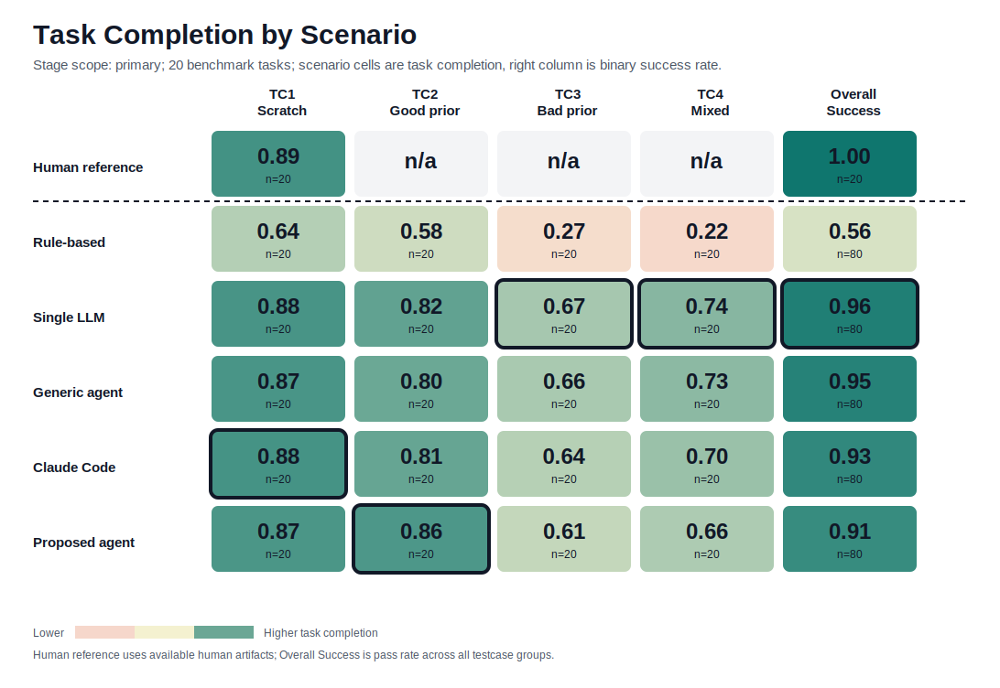
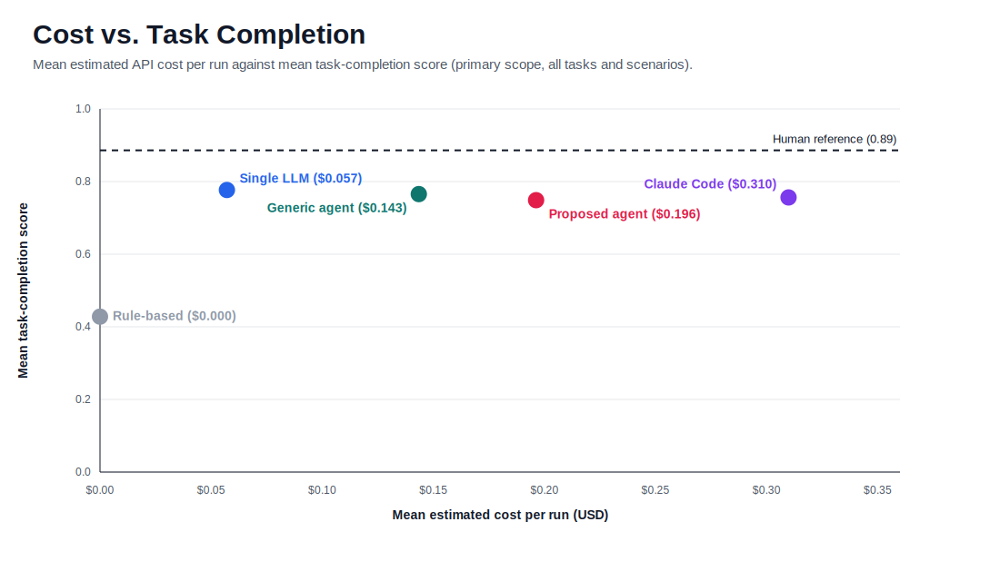

# KaggleBench

[](https://github.com/SeanKraemer/kaggle-bench/actions/workflows/ci.yml)
[](https://github.com/SeanKraemer/kaggle-bench/actions/workflows/validate.yml)

A benchmark for whether AI agents can **repair tabular preprocessing plans** — not just write
them from scratch. Each of 20 tasks is grounded in a real Kaggle competition and gives an agent
the competition context, a dataset profile, a fixed bank of candidate preprocessing actions, and
a scenario describing which actions are already active (some useful, some harmful). The agent
must propose which actions to **add** and which prior actions to **remove**, and is scored
deterministically against ground truth distilled from top-scoring public Kaggle solutions.

Six systems are evaluated across all 20 tasks and 4 scenario types — a human reference, a
deterministic rule-based baseline, a one-shot LLM call, a generic tool-using agent, Claude Code,
and a purpose-built two-pass agent — for **1,700 scored runs** in total.

KaggleBench began as the cumulative team project for UIUC's CS 498 *AI Agents in the Wild*
graduate course (Spring 2026, four-person team); my work spanned task authoring, agent
implementations, the evaluation/aggregation pipeline, and the benchmark campaign. This
repository is my maintained copy.

## Results

| System | Success rate | Add F1 | Remove recall | Task completion | Mean tokens/run | Mean cost/run |
| --- | ---: | ---: | ---: | ---: | ---: | ---: |
| Human reference | 100.0% | 0.772 | 1.000 | **0.886** | — | — |
| One-shot LLM (`single_llm`) | 96.25% | 0.676 | 0.878 | **0.777** | 2,034 | $0.057 |
| Generic tool agent (`generic_agent`) | 95.00% | 0.642 | 0.889 | 0.766 | 15,855 | $0.143 |
| Claude Code (`claude_code`) | 92.50% | 0.614 | 0.899 | 0.756 | 5,719 | $0.310 |
| Two-pass agent (`proposed_agent`) | 91.25% | 0.676 | 0.822 | 0.749 | 20,389 | $0.196 |
| Rule-based heuristics (`rule_based`) | 56.25% | 0.223 | 0.633 | 0.428 | — | $0.000 |

*Task completion = 0.5 · Add F1 + 0.5 · Remove recall, averaged over 80 task–scenario groups per
system (success threshold 0.5). Source: [`agent_summary.csv`](eval/results/presentation/current/agent_summary.csv),
regenerable with `make aggregate`.*





### What the numbers say

**Proposing good preprocessing is nearly solved; selectively undoing bad preprocessing is not.**
On from-scratch scenarios (TC1) every LLM-based method lands within 0.02 of the human reference
(0.87–0.88 vs 0.89). On fault-injected and mixed-history scenarios (TC3/TC4) every method drops
0.15–0.25: remove recall falls from a uniform 1.00 on clean histories to 0.62–0.81 once harmful
actions are mixed into otherwise-reasonable context. Diagnosing *which prior step is hurting you*
is the hard, discriminating part of the benchmark.

**Context engineering beat agentic scaffolding at this granularity.** The one-shot LLM — a single
API call over a carefully structured context (dataset profiles, action-bank summaries, scenario
state) — is the best non-human system overall while using 3–10× fewer tokens and 2.5–5× less
money than the agentic systems. Once the relevant evidence is precomputed into the prompt,
additional tool-use autonomy mostly added cost, not accuracy.

**The purpose-built agent won where its design targeted, and lost where it didn't.** The two-pass
add/remove agent posts the best partial-good score of any system (0.86 on TC2) and ties the best
add F1, but its rollback pass is the weakest of the LLM methods (0.82 remove recall), which costs
it the overall ranking. The failure mode is over-removal: pulling legitimate prior actions along
with harmful ones.

## How it works

```
task bundle ──► context builder ──► agent ──► prediction validation ──► eval ──► aggregate
(task.json,     (dataset profiles,  (one of    (normalize/dedupe         (per-run   (benchmark
 action bank,    action summaries,   six        add/remove ids)           scores)    reports,
 testcase)       scenario state)     systems)                                        figures)
```

- **Task bundles** ([data/tasks/](data/tasks/)) — 20 competitions spanning regression,
  binary/multiclass classification, and time-series forecasting. Each bundle holds the
  competition metadata, a candidate action bank (1,268 actions across the benchmark, median 61
  per task: the gold actions plus distractors from the same action vocabulary), four scenario
  testcases, and a human-baseline annotation with provenance.
- **Scenarios** — `tc1_from_scratch` (empty history), `tc2_partial_good` (some correct actions
  active), `tc3_fault_injected` (harmful actions active), `tc4_mixed_history` (both). Scenarios
  share the task's gold actions, so scores isolate the *repair* skill from task knowledge.
- **Agents** ([agent/](agent/)) — shared infrastructure (bundle loading, profiling, prompt
  scaffolds, output validation) under six runners: [rule_based](agent/rule_based/),
  [single_llm](agent/single_llm/), [generic_agent](agent/generic_agent/),
  [claude_code](agent/claude_code/), [proposed_agent](agent/proposed_agent/), plus committed
  human baselines. The two-pass agent separates an add-oriented recovery pass from a
  remove-oriented rollback pass with a final reconciliation step.
- **Evaluation** ([eval/](eval/)) — [eval.py](eval/eval.py) scores a single output JSON against
  a testcase; [aggregate.py](eval/aggregate.py) rolls runs up into per-task and benchmark-wide
  reports; [validate_artifacts.py](eval/scripts/validate_artifacts.py) schema-checks every
  committed artifact. Scoring is pure JSON-against-JSON: deterministic, model-free, and cheap.

Design rationale, metric definitions, and the task-authoring methodology are written up in
[docs/DESIGN.md](docs/DESIGN.md).

## Running locally

Requirements: [uv](https://docs.astral.sh/uv/). Everything below runs offline against committed
artifacts — no API keys, no Kaggle account.

```bash
make setup     # uv sync --dev && pre-commit install
make test      # agent + evaluator unit test suites
make demo      # score a committed human-baseline run end to end
make validate  # schema-check all committed benchmark artifacts
```

`make demo` scores the Zillow human baseline against its from-scratch testcase and prints the
full metric breakdown (add F1 0.667, remove recall 1.000, task completion 0.833 — the same row
you'll find in [the Zillow report](eval/results/benchmarks/zillow-prize-1-primary.md)).

### Reproducing the full benchmark

Agent runs need an Anthropic API key and local copies of the competition data:

```bash
make data TASK=spaceship-titanic   # kaggle CLI download (accept rules on kaggle.com first)
```

Raw competition data is licensed by Kaggle per competition and is **never committed or
redistributed** — the repo ships download tooling and derived metadata only. Regenerating all
1,680 agent runs costs roughly $280 in API spend at the prices we measured (the one-shot LLM
sweep alone is about $23); per-run telemetry (tokens, tool calls, estimated cost) is recorded in
each output artifact. Reports and figures regenerate from local outputs with `make aggregate`
(the target refuses to run if raw outputs are absent, so a fresh clone can't clobber the
committed results).

## Testing

`make test` runs ~170 unit tests over the deterministic core: bundle loading, action-bank
filtering and visibility policy, dataset profilers, context building, prediction validation,
output-artifact writing, each runner's orchestration (with the LLM client faked), and the
evaluator's scoring math. CI runs lint (ruff), type checking (pyright), both test suites, and
the artifact validators on every push and pull request.

## Project structure

```
agent/                  Agent implementations, shared infra, prompts, profilers, tests
  agentic_core/         Shared agentic loop, tool runtime, tracing
  llm/                  Anthropic client, auth, pricing/telemetry
  <runner>/             rule_based, single_llm, generic_agent, claude_code, proposed_agent
data/schema/            JSON schemas + canonical action vocabulary
data/tasks/<slug>/      Task bundle: task.json, candidate_actions.json, testcases/, human_baseline/
data/collector/         Notebook-collection tooling used during task authoring
eval/                   eval.py, aggregate.py, validators, generated results
  results/benchmarks/   Per-task aggregate reports (primary + all scopes)
  results/presentation/ Benchmark-wide CSVs, SVG figures, HTML dashboard
```

What is and isn't committed (raw data, run outputs, traces) is spelled out in
[ARTIFACT_POLICY.md](ARTIFACT_POLICY.md).

## Design notes & limitations

- **Ground truth is distilled, not executed.** Gold actions come from human review of
  top-scoring public Kaggle notebooks, mapped onto a canonical action vocabulary. That makes
  scoring deterministic and reproducible, but inherits curation judgment: a defensible action
  missing from the bank scores as a false positive. The action-bank visibility policy
  ([agent/action_bank.py](agent/action_bank.py)) at least guarantees every system sees the same
  constrained menu.
- **Action-level scoring, not outcome-level.** The benchmark never trains models, so it can't
  credit an unconventional pipeline that happens to work. That's a deliberate trade: it makes
  1,700 runs affordable and the metric stable, at the cost of treating the distilled workflow
  as canonical.
- **The proposed agent's loss is informative, and we report it.** Its two-pass design helped
  exactly where designed (best TC2 score, tied-best add F1) and its rollback reconciliation
  over-removes. We kept the result rather than tuning until the headline flattered the custom
  system.
- **Human reference covers TC1 only** (annotators built from-scratch baselines; n/a cells in the
  heatmap). It bounds add-side performance but not repair scenarios.
- **Stochastic agents ran 5 tries per task–scenario**; reported numbers are group means. Token
  and cost figures come from per-run telemetry and exclude the human and rule-based rows, which
  consume no API.

## What I learned

- **Evaluation design is the product.** The constrained action bank — fixed menu, add/remove
  edits, deterministic scoring — is what made comparing six heterogeneous systems possible at
  all. Open-ended "improve this pipeline" formulations had no defensible ground truth.
- **Spend your tokens on context, then on autonomy.** Precomputing dataset profiles and action
  summaries into a structured prompt beat giving agents tools to discover the same facts, on
  both cost and accuracy.
- **Removal is a different skill from addition.** Every system, including the strongest
  commercial agent, finds proposing good actions far easier than identifying which existing
  actions are harmful. Benchmarks that only test from-scratch generation overstate agent
  ability on real, messy workflows.
- **Schema-validate everything.** 1,700 runs produced across multiple machines and six systems
  stayed mergeable because every artifact validates against JSON schemas in CI before it lands.

## License

MIT — see [LICENSE](LICENSE).
